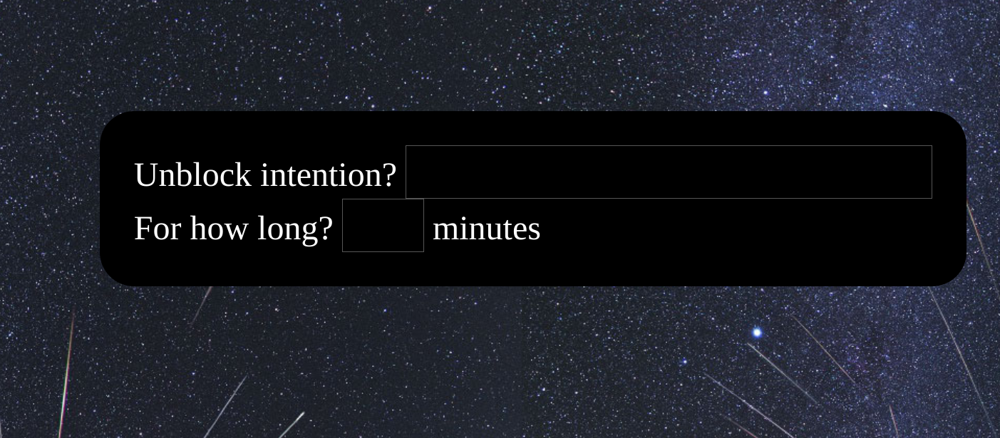

# Unblock with Intention

This is a simple browser extension which redirects away from
distracting sites. It prompts you to provide an unblock
justification and time interval.  This way, you can briefly unblock as
long as you have a constructive intention.



While blocking is paused, your intention is displayed at the bottom of
the page:


The inspiration for this was using a site blocker and finding that I
would disable it to do something constructive, but then neglect to
re-enable it.

It is also extremely efficient, adding nearly 0 overhead to normal
page loads, due to the clever approach in [cirocosta's very simple
site blocker](https://github.com/cirocosta/site-blocker), which this
is forked from. See [his
post](https://ops.tips/blog/extension-to-block-websites/) about the
topic.

## Usage

1. Clone this repository

```
$ git clone https://github.com/mgsloan/unblock-with-intent
```

2. Add your distraction sites to the url patterns in `background.js`
   and in `manifest.json`.

3. Load the extension

  - Open chrome
  - Go to chrome://extensions
  - Enable the `Developer mode` toggle in the upper right corner
  - Press `load unpacked extension` and then select this repo

Consider making your own redirect page, and using that instead.  The
page this extension uses the current [astronomy picture of the
day](https://apod.nasa.gov/apod/astropix.html) as a background, and
displays info about the blocked url.  If you press the `u` key, then
the unblock dialog will appear.
